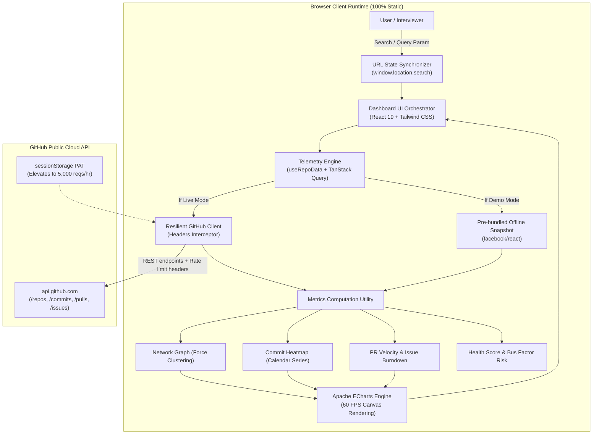

# ⚡ RepoPulse — Open-Source Ecosystem Intelligence & Contributor Network

[](https://donatoalvarez.dev/repo-pulse/)
[](https://opensource.org/licenses/MIT)
[](https://www.typescriptlang.org/)
[](https://react.dev/)
[](#zero-vps-architecture)

> **Live Demo:** [https://donatoalvarez.dev/repo-pulse/](https://donatoalvarez.dev/repo-pulse/)
>
> **RepoPulse** is an in-browser analytics and telemetry platform for open-source repositories. It runs **100% client-side**, consumes GitHub's public API directly from the browser.

---

## 🎯 Executive Summary & Case Study

### The Problem
Engineering leaders, open-source maintainers, and developer advocates need deep visibility into repository health, maintainer burnout risks, contributor community clusters, and PR turnaround velocity. Traditional telemetry dashboards require heavyweight backend services, database migrations, and expensive infrastructure.

### The Solution: 100% Client-Side Architecture
RepoPulse demonstrates that complex data telemetry, community graph clustering, and time-series heatmaps can execute smoothly at 60 FPS directly inside the browser sandbox:
1. **Force-Directed Contributor Network**: Computes dynamic collaboration graphs with weighted edges, physics simulation, and community clustering based on commit co-authorship and PR reviews.
2. **Commit Frequency Heatmap**: Visualizes commit cadence across days and weeks using a high-density calendar grid.
3. **PR Velocity & Issue Burndown**: Dual-series charts tracking lead time to merge, backlog intake, and resolution velocity with interactive zoom scrubbers.
4. **Deep URL Synchronization**: All repository parameters, active tabs, and highlighted contributor states serialize directly to URL search params (`?repo=...&tab=...&user=...`), allowing 1-click reproducible sharing.
5. **Rate-Limit Resilience & Zero Friction**: Includes proactive header quota meters, backoff guardrails, optional client-side PAT input stored exclusively in `sessionStorage`, and pre-bundled **Demo Snapshots** (`facebook/react`) for instant exploration without consuming API calls.

---

## 🏛️ Architecture & Data Flow



---

## ⚖️ Technical Decisions & Trade-Offs

| Decision | Alternative Evaluated | Why This Choice Won |
|---|---|---|
| **Apache ECharts (Canvas)** | D3.js (SVG) / Chart.js | Renders complex force-directed physics graphs with hundreds of nodes and thousands of data points at **60 FPS** without DOM bloating or SVG layout thrashing. |
| **TanStack Query v5** | Ad-hoc `useEffect` + `fetch` | Automatic request deduplication, optimistic caching with 10-minute stale windows, background garbage collection, and custom retry policies preventing API hammering. |
| **`sessionStorage` for PAT** | `localStorage` / Cookies | Strict client isolation: tokens are never persisted across browser restarts and never sent to any server other than directly to `api.github.com`. |
| **Deep URL Parameter Sync** | Internal React State / Redux | Allows instant link sharing and restores exact filter contexts via native browser `popstate` and `pushState` events. |
| **Pre-Bundled Offline Snapshots** | Requiring Mandatory Tokens | Reviewers and hiring managers can explore rich data immediately even if unauthenticated public rate limits (60/hr) are saturated. |

---

## 🚀 Key Features

* **Repository Health Score (0-100)**: Composite index factoring in contributor diversity, PR turnaround velocity, and backlog resolution rate.
* **Bus Factor Risk Metric**: Calculates the minimum number of core contributors who account for $\ge 50\%$ of overall commits.
* **Community Clustering**: Categorizes contributors into Core Maintainers, Frequent Collaborators, Active Contributors, and Community tiers.
* **Accessible Command Palette (`Cmd + K`)**: Instant keyboard navigation, flagship repository switcher (`facebook/react`, `angular/angular`, `vitejs/vite`, `torvalds/linux`, etc.), and view jumping.
* **Proactive API Quota Badge**: Real-time visualization of remaining API calls, countdown until reset, and rate limit status alerts.

---

## 🛠️ Getting Started Locally

### Prerequisites
- Node.js `v20+` or `v24+`
- npm `10+`

### Installation & Development
```bash
# Clone the repository
git clone https://github.com/dalvarez/repo-pulse.git
cd repo-pulse

# Install dependencies
npm install

# Start development server with instant HMR
npm run dev
```

### Automated Testing & Linting
```bash
# Run unit & integration test suites (Vitest)
npm run test

# Run Oxlint static analysis
npm run lint

# Build static production bundle for GitHub Pages
npm run build
```

---

## 🚢 Deployment to GitHub Pages

The repository contains an automated GitHub Actions workflow (`.github/workflows/deploy.yml`):
1. Runs code quality checks (`npm run lint`).
2. Executes test suite (`npm run test`).
3. Compiles the static production bundle (`npm run build`).
4. Deploys the `./dist` folder directly to GitHub Pages.

To enable GitHub Pages in your repository:
1. Go to **Settings > Pages**.
2. Under **Build and deployment > Source**, select **GitHub Actions**.
3. Push to `main` — deployment will trigger automatically.

---

## 📄 License

Distributed under the [MIT License](LICENSE).
